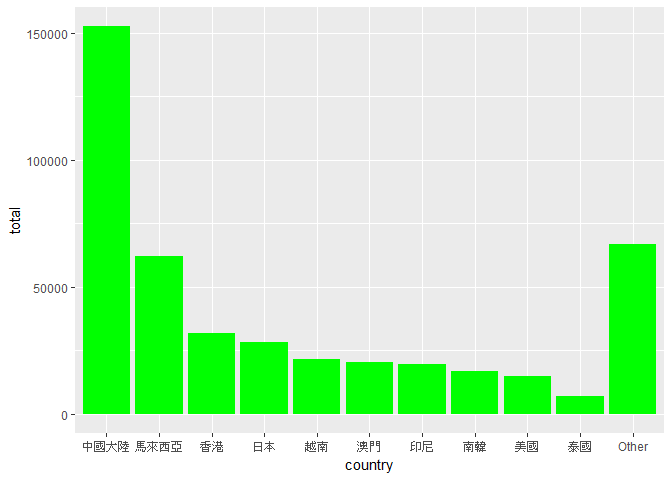
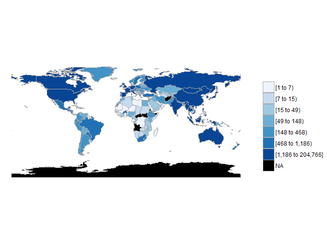
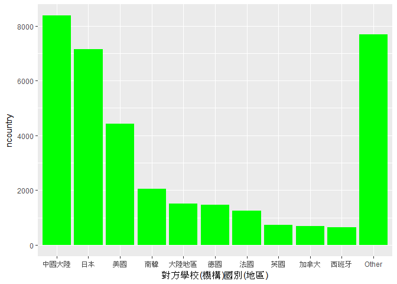
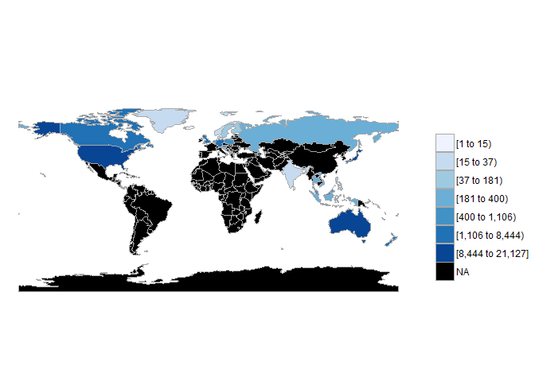

106-2 大數據分析方法 作業二
================
Yi-Ju Tseng

作業完整說明[連結](https://docs.google.com/document/d/1aLGSsGXhgOVgwzSg9JdaNz2qGPQJSoupDAQownkGf_I/edit?usp=sharing)

學習再也不限定在自己出生的國家，台灣每年有許多學生選擇就讀國外的大專院校，同時也有人多國外的學生來台灣就讀，透過分析[大專校院境外學生人數統計](https://data.gov.tw/dataset/6289)、[大專校院本國學生出國進修交流數](https://data.gov.tw/dataset/24730)、[世界各主要國家之我國留學生人數統計表](https://ws.moe.edu.tw/Download.ashx?u=C099358C81D4876CC7586B178A6BD6D5062C39FB76BDE7EC7685C1A3C0846BCDD2B4F4C2FE907C3E7E96F97D24487065577A728C59D4D9A4ECDFF432EA5A114C8B01E4AFECC637696DE4DAECA03BB417&n=4E402A02CE6F0B6C1B3C7E89FDA1FAD0B5DDFA6F3DA74E2DA06AE927F09433CFBC07A1910C169A1845D8EB78BD7D60D7414F74617F2A6B71DC86D17C9DA3781394EF5794EEA7363C&icon=..csv)可以了解103年以後各大專院校國際交流的情形。請同學分析以下議題，並以視覺化的方式呈現分析結果，呈現103年以後大專院校國際交流的情形。

來台境外生分析
--------------

### 資料匯入與處理

``` r
#這是R Code Chunk
library(readr)
library(dplyr)
library(ggplot2)
C103<- read_csv("http://stats.moe.gov.tw/files/detail/103/103_ab103_C.csv")
U103<- read_csv("http://stats.moe.gov.tw/files/detail/103/103_ab103_S.csv")
C104<- read_csv("http://stats.moe.gov.tw/files/detail/104/104_ab104_C.csv")
U104<- read_csv("http://stats.moe.gov.tw/files/detail/104/104_ab104_S.csv")
C105<- read_csv("http://stats.moe.gov.tw/files/detail/105/105_ab105_C.csv")
U105<- read_csv("http://stats.moe.gov.tw/files/detail/105/105_ab105_S.csv")
C106<- read_csv("http://stats.moe.gov.tw/files/detail/106/106_ab105_C.csv")
U106<- read_csv("http://stats.moe.gov.tw/files/detail/106/106_ab105_S.csv")
```

### 哪些國家來台灣唸書的學生最多呢？

``` r
#這是R Code Chunk
C103<-data.frame(country=C103$國別,people103=C103$`學位生-正式修讀學位外國生`+C103$`學位生-僑生(含港澳)`+C103$`學位生-正式修讀學位陸生`+
                   C103$`非學位生-外國交換生`+C103$`非學位生-外國短期研習及個人選讀`+
                   C103$`非學位生-大專附設華語文中心學生`+C103$`非學位生-大陸研修生`+
                   C103$`非學位生-海青班`+C103$境外專班)

C104<-data.frame(country=C104$國別,people104=C104$`學位生-正式修讀學位外國生`+C104$`學位生-僑生(含港澳)`+C104$`學位生-正式修讀學位陸生`+
                   C104$`非學位生-外國交換生`+C104$`非學位生-外國短期研習及個人選讀`+
                   C104$`非學位生-大專附設華語文中心學生`+C104$`非學位生-大陸研修生`+
                   C104$`非學位生-海青班`+C104$境外專班)
C103104<-full_join(C103,C104,by="country")

C105<-data.frame(country=C105$國別,people105=C105$`學位生_正式修讀學位外國生`+C105$`學位生_僑生(含港澳)`+C105$`學位生_正式修讀學位陸生`+
                   C105$`非學位生_外國交換生`+C105$`非學位生_外國短期研習及個人選讀`+
                   C105$`非學位生_大專附設華語文中心學生`+C105$`非學位生_大陸研修生`+
                   C105$`非學位生_海青班`+C105$境外專班)
C103104105<-full_join(C103104,C105,by="country")

C106<-data.frame(country=C106$國別,people106=C106$`學位生_正式修讀學位外國生`+C106$`學位生_僑生(含港澳)`+C106$`學位生_正式修讀學位陸生`+
                   C106$`非學位生_外國交換生`+C106$`非學位生_外國短期研習及個人選讀`+
                   C106$`非學位生_大專附設華語文中心學生`+C106$`非學位生_大陸研修生`+
                   C106$`非學位生_海青班`+C106$境外專班)
C103104105106<-full_join(C103104105,C106,by="country")
C103104105106[is.na(C103104105106)]=0
C103104105106$total<-C103104105106$people103+C103104105106$people104+C103104105106$people105+C103104105106$people106
C103104105106<-arrange(C103104105106,desc(C103104105106$total))

knitr::kable(C103104105106[1:10,c(1,6)])
```

| country  |   total|
|:---------|-------:|
| 中國大陸 |  152524|
| 馬來西亞 |   62031|
| 香港     |   31940|
| 日本     |   28200|
| 越南     |   21670|
| 澳門     |   20302|
| 印尼     |   19620|
| 南韓     |   16948|
| 美國     |   14846|
| 泰國     |    7035|

### 哪間大學的境外生最多呢？

``` r
#這是R Code Chunk

U103$`非學位生-大陸研修生`<-gsub("…","0",U103$`非學位生-大陸研修生`)
U103$`非學位生-大陸研修生`<-as.numeric(U103$`非學位生-大陸研修生`)
U103<-data.frame(school=U103$學校名稱,people103=U103$`學位生-正式修讀學位外國生`+U103$`學位生-僑生(含港澳)`+U103$`學位生-正式修讀學位陸生`+
                   U103$`非學位生-外國交換生`+U103$`非學位生-外國短期研習及個人選讀`+U103$`非學位生-大專附設華語文中心學生`+
                   U103$`非學位生-大陸研修生`+U103$`非學位生-海青班`+U103$境外專班)

U104$`非學位生-大陸研修生`<-gsub("…","0",U104$`非學位生-大陸研修生`)
U104$`非學位生-大陸研修生`<-as.numeric(U104$`非學位生-大陸研修生`)
U104<-data.frame(school=U104$學校名稱,people104=U104$`學位生-正式修讀學位外國生`+U104$`學位生-僑生(含港澳)`+U104$`學位生-正式修讀學位陸生`+
                   U104$`非學位生-外國交換生`+U104$`非學位生-外國短期研習及個人選讀`+U104$`非學位生-大專附設華語文中心學生`+
                   U104$`非學位生-大陸研修生`+U104$`非學位生-海青班`+U104$境外專班)
U103104<-full_join(U103,U104,by="school")

U105$`非學位生_大陸研修生`<-gsub("…","0",U105$`非學位生_大陸研修生`)
U105$`非學位生_大陸研修生`<-as.numeric(U105$`非學位生_大陸研修生`)
U105<-data.frame(school=U105$學校名稱,people105=U105$`學位生_正式修讀學位外國生`+U105$`學位生_僑生(含港澳)`+U105$`學位生_正式修讀學位陸生`+
                   U105$`非學位生_外國交換生`+U105$`非學位生_外國短期研習及個人選讀`+U105$`非學位生_大專附設華語文中心學生`+
                   U105$`非學位生_大陸研修生`+U105$`非學位生_海青班`+U105$境外專班)
U103104105<-full_join(U103104,U105,by="school")

U106$`非學位生_大陸研修生`<-gsub("…","0",U106$`非學位生_大陸研修生`)
U106$`非學位生_大陸研修生`<-as.numeric(U106$`非學位生_大陸研修生`)
U106<-data.frame(school=U106$學校名稱,people106=U106$`學位生_正式修讀學位外國生`+U106$`學位生_僑生(含港澳)`+U106$`學位生_正式修讀學位陸生`+
                   U106$`非學位生_外國交換生`+U106$`非學位生_外國短期研習及個人選讀`+U106$`非學位生_大專附設華語文中心學生`+
                   U106$`非學位生_大陸研修生`+U106$`非學位生_海青班`+U106$境外專班)
U103104105106<-full_join(U103104105,U106,by="school")
U103104105106[is.na(U103104105106)]=0
U103104105106$total<-U103104105106$people103+U103104105106$people104+U103104105106$people105+U103104105106$people106
U103104105106<-arrange(U103104105106,desc(U103104105106$total))
knitr::kable(U103104105106[1:10,c(1,6)])
```

| school           |  total|
|:-----------------|------:|
| 無法區分校別     |  92586|
| 國立臺灣師範大學 |  22113|
| 國立臺灣大學     |  18199|
| 中國文化大學     |  16074|
| 銘傳大學         |  16057|
| 淡江大學         |  13887|
| 國立政治大學     |  11626|
| 國立成功大學     |  10982|
| 輔仁大學         |   9499|
| 逢甲大學         |   9474|

### 各個國家來台灣唸書的學生人數條狀圖

因為國家數太多，所以顯示前十名，剩下以其他表示。

``` r
#這是R Code Chunk
library(ggplot2)
C103104105106n<-C103104105106[,-c(2:5)]
groupcountry<-C103104105106n%>%
  group_by(country)%>%
  tally(total,sort=TRUE)%>%
  group_by(country = factor(c(country[1:10], rep("Other", n() -10)),
                            levels = c(country[1:10], "Other")))%>%
  tally(n)
colnames(groupcountry)<-c("country","total")
ggplot()+geom_bar(data=groupcountry,
                  aes(x=country,y=total),
                  stat = "identity",
                  fill = "green")
```



### 各個國家來台灣唸書的學生人數面量圖

來台灣念書最多的為中國學生

``` r
#這是R Code Chunk
library(choroplethr)
library(choroplethrMaps)
countryname<-read_csv("CountriesComparisionTable.csv")
colnames(countryname)<-c("ISO3","English","country")
TotalCountry<-merge(C103104105106[,c(1,6)],countryname,by="country")
colnames(TotalCountry)<-c("country","value","ISO3","region")
TotalCountry[5,2]<-TotalCountry[5,2]+TotalCountry[91,2]+TotalCountry[159,2]
TotalCountry[107,2]<-TotalCountry[107,2]+TotalCountry[108,2]
TotalCountry<-TotalCountry%>%
  subset(region!="Unmatch")%>%
  subset(country!="索馬利蘭共和國")
A3<-country_choropleth(TotalCountry)
A3
```



台灣學生國際交流分析
--------------------

### 資料匯入與處理

``` r
#這是R Code Chunk
library(dplyr)
library(readr)
tw<-read_csv("Student_RPT_07.csv")
```

    ## Parsed with column specification:
    ## cols(
    ##   學年度 = col_integer(),
    ##   學期 = col_integer(),
    ##   設立別 = col_character(),
    ##   學校類別 = col_character(),
    ##   學校代碼 = col_character(),
    ##   學校名稱 = col_character(),
    ##   系所代碼 = col_integer(),
    ##   系所名稱 = col_character(),
    ##   學制 = col_character(),
    ##   `對方學校(機構)國別(地區)` = col_character(),
    ##   `對方學校(機構)中文名稱` = col_character(),
    ##   `對方學校(機構)英文名稱` = col_character(),
    ##   小計 = col_integer(),
    ##   男 = col_integer(),
    ##   女 = col_integer()
    ## )

    ## Warning: 2 parsing failures.
    ## row # A tibble: 2 x 5 col     row col      expected               actual file                 expected   <int> <chr>    <chr>                  <chr>  <chr>                actual 1 23579 系所代碼 no trailing characters A2     'Student_RPT_07.csv' file 2 34284 系所代碼 no trailing characters A2     'Student_RPT_07.csv'

### 台灣大專院校的學生最喜歡去哪些國家進修交流呢？

``` r
#這是R Code Chunk
a<-subset(tw,`學年度`>102)%>%
  group_by(`對方學校(機構)國別(地區)`)%>%
  summarise(ncountry=sum(`小計`))
  b<-arrange(a,desc(ncountry))
 knitr::kable(b[1:10,])
```

| 對方學校(機構)國別(地區) |  ncountry|
|:-------------------------|---------:|
| 中國大陸                 |      8375|
| 日本                     |      7142|
| 美國                     |      4427|
| 南韓                     |      2050|
| 大陸地區                 |      1516|
| 德國                     |      1466|
| 法國                     |      1258|
| 英國                     |       742|
| 加拿大                   |       689|
| 西班牙                   |       642|

### 哪間大學的出國交流學生數最多呢？

``` r
#這是R Code Chunk
c<-subset(tw,`學年度`>102)%>%
  group_by(`學校名稱`)%>%
  summarise(nschool=sum(小計))
  d<-arrange(c,desc(nschool))
 knitr::kable(d[1:10,]) 
```

| 學校名稱     |  nschool|
|:-------------|--------:|
| 國立臺灣大學 |     2224|
| 淡江大學     |     2038|
| 國立政治大學 |     1876|
| 逢甲大學     |     1346|
| 元智大學     |     1106|
| 國立臺北大學 |      956|
| 國立交通大學 |      951|
| 東海大學     |      931|
| 東吳大學     |      873|
| 國立成功大學 |      846|

### 台灣大專院校的學生最喜歡去哪些國家進修交流條狀圖

因為國家數太多，只顯示前十名，剩下以其他表示。第一名台灣留學國家為中國。

``` r
#這是R Code Chunk
groupcountry1<-b%>%
  group_by(`對方學校(機構)國別(地區)`)%>%
  tally(ncountry,sort=TRUE)%>%
  group_by(`對方學校(機構)國別(地區)` = factor(c(`對方學校(機構)國別(地區)`[1:10], rep("Other", n() - 10)),
                                     levels = c(`對方學校(機構)國別(地區)`[1:10], "Other")))%>%tally(n)
colnames(groupcountry1)<-c("對方學校(機構)國別(地區)","ncountry")
ggplot()+geom_bar(data=groupcountry1,aes(x=`對方學校(機構)國別(地區)`,y=ncountry),
                  stat = "identity",
                  fill = "green")
```



### 台灣大專院校的學生最喜歡去哪些國家進修交流面量圖

``` r
#這是R Code Chunk
countryname<-read_csv("CountriesComparisionTable.csv")
colnames(countryname)<-c("ISO3","English","中文")
outNum<-a
colnames(outNum)<-c("國名","count")
EoutNum<-merge(outNum,countryname,by.x="國名",by.y="中文")
colnames(EoutNum)<-c("國名","value","ISO3","region")
EoutNum<-EoutNum%>%
  subset(region!="Unmatch")
A6<-country_choropleth(EoutNum,num_colors=9)
A6
```


台灣學生出國留學分析
--------------------

### 資料匯入與處理

``` r
#這是R Code Chunk
library(dplyr)
library(readr)
library(ggplot2)
world<-read_csv("https://ws.moe.edu.tw/Download.ashx?u=C099358C81D4876CC7586B178A6BD6D5062C39FB76BDE7EC7685C1A3C0846BCDD2B4F4C2FE907C3E7E96F97D24487065577A728C59D4D9A4ECDFF432EA5A114C8B01E4AFECC637696DE4DAECA03BB417&n=4E402A02CE6F0B6C1B3C7E89FDA1FAD0B5DDFA6F3DA74E2DA06AE927F09433CFBC07A1910C169A1845D8EB78BD7D60D7414F74617F2A6B71DC86D17C9DA3781394EF5794EEA7363C&icon=..csv")
```

### 台灣學生最喜歡去哪些國家留學呢？

台灣學生最喜歡去美國留學。

``` r
#這是R Code Chunk
world$X4=NULL
world$X5=NULL
world$X6=NULL
world<-arrange(world,desc(world$總人數))
knitr::kable(world[1:10,c(2,3)])
```

| 國別     | 總人數 |
|:---------|:------:|
| 美國     |  21127 |
| 澳大利亞 |  13582 |
| 日本     |  8444  |
| 加拿大   |  4827  |
| 英國     |  3815  |
| 德國     |  1488  |
| 紐西蘭   |  1106  |
| 波蘭     |   561  |
| 馬來西亞 |   502  |
| 奧地利   |   419  |

### 台灣學生最喜歡去哪些國家留學面量圖

``` r
#這是R Code Chunk
countryname<-read_csv("CountriesComparisionTable.csv")
```

    ## Parsed with column specification:
    ## cols(
    ##   ISO3 = col_character(),
    ##   English = col_character(),
    ##   Taiwan = col_character()
    ## )

``` r
colnames(countryname)<-c("ISO3","English","國別")
Eworld<-merge(world,countryname,by="國別")
colnames(Eworld)<-c("國名","洲別","value","ISO3","region")
A8<-country_choropleth(Eworld)
```

    ## Warning in super$initialize(country.map, user.df): Your data.frame contains
    ## the following regions which are not mappable: Singapore

    ## Warning in self$bind(): The following regions were missing and are being
    ## set to NA: afghanistan, angola, azerbaijan, moldova, madagascar, mexico,
    ## macedonia, mali, myanmar, montenegro, mongolia, mozambique, mauritania,
    ## burundi, malawi, namibia, france, niger, nigeria, nicaragua, oman,
    ## pakistan, panama, peru, papua new guinea, north korea, benin, portugal,
    ## paraguay, israel, qatar, romania, rwanda, western sahara, saudi arabia,
    ## sudan, burkina faso, south sudan, senegal, solomon islands, sierra leone,
    ## el salvador, somaliland, somalia, republic of serbia, suriname, slovakia,
    ## slovenia, swaziland, syria, chad, togo, tajikistan, turkmenistan, east
    ## timor, bulgaria, trinidad and tobago, tunisia, turkey, taiwan, united
    ## republic of tanzania, uganda, ukraine, uruguay, uzbekistan, the bahamas,
    ## venezuela, vanuatu, yemen, south africa, zambia, zimbabwe, bosnia and
    ## herzegovina, belarus, albania, belize, bolivia, brazil, bhutan, botswana,
    ## central african republic, switzerland, chile, united arab emirates, china,
    ## ivory coast, cameroon, democratic republic of the congo, republic of
    ## congo, colombia, costa rica, cuba, northern cyprus, cyprus, argentina,
    ## czech republic, djibouti, dominican republic, algeria, ecuador, egypt,
    ## eritrea, spain, armenia, estonia, ethiopia, fiji, gabon, georgia, ghana,
    ## antarctica, guinea, gambia, guinea bissau, equatorial guinea, greece,
    ## guatemala, guyana, honduras, croatia, haiti, hungary, ireland, iran, iraq,
    ## italy, jamaica, jordan, kazakhstan, kenya, kyrgyzstan, cambodia, south
    ## korea, kosovo, kuwait, laos, lebanon, liberia, libya, lesotho, lithuania,
    ## luxembourg, latvia, morocco

``` r
A8
```



綜合分析
--------

請問來台讀書與離台讀書的來源國與留學國趨勢是否相同(5分)？想來台灣唸書的境外生，他們的母國也有很多台籍生嗎？請圖文並茂說明你的觀察(10分)。

趨勢不同，中日美韓也有很多台灣生。

``` r
#這是R Code Chunk


ggplot()+geom_bar(data=groupcountry1,aes(x=`對方學校(機構)國別(地區)`,y=ncountry),
                  stat = "identity",
                  fill = "green")
```


``` r
ggplot()+geom_bar(data=groupcountry,
                  aes(x=country,y=total),
                  stat = "identity",
                  fill = "green")
```


